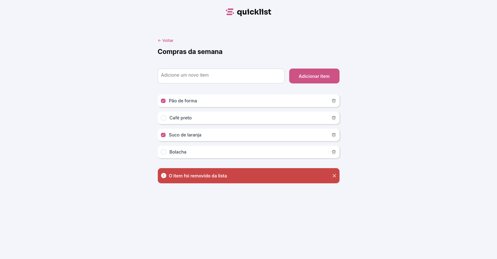
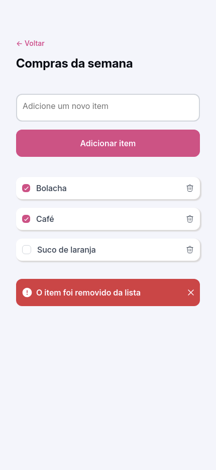

# quicklist

**quicklist** is a _"to-do"_ list for **grocery shopping**.
* Add items on the list
* Delete items
* Deleted item message will appear just once even when more than one item is deleted.
* The deleted item message can be removed with the "x" button
* Styled checkbox
* Mobile first

---
**quicklist** is a project for **_Rocketseat's_** **Fullstack** bootcamp.